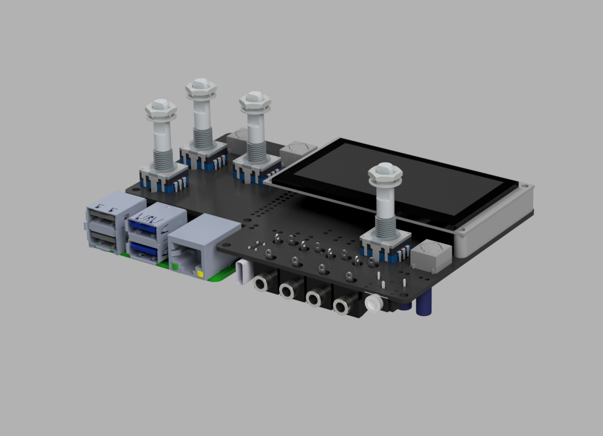

# Fates3d
Fates 3d reference design for case/accessory makers

The files provided are made in Autodesk Fusion 360.
Thank you @okyeron for providing the vector file of the PCB. Made it a bit easier :)

Thanks everyone who encouraged me to finish this model, I have not tested it, so don't go run a manufacturing round of cases for Fates.
If you do, this guy won't take the blame.

The Raspberry Pi model is by Hasanain Shuja and [can be found on GrabCad](https://grabcad.com/library/raspberry-pi-4-model-b-1).
The Rotary Encoders are by Otto Winter and [can be found on 3dContentCentral](https://www.3dcontentcentral.com/Download-Model.aspx?catalogid=171&id=415657). 
The headphones jack is [provided by CUI Devices](https://www.cuidevices.com/product/resource/digikey3dmodel/sj1-3524ng) and we wish every manufacturer would hand out the f**king mechanical model. 

The rest is quickly modeled by me. I just needed the mechanical sizes no need to compete with [Noel Rubin (TekNoelogy)](https://www.instagram.com/teknoelogy/)

Hope this is helpful to a few of you

ciao.ubi
